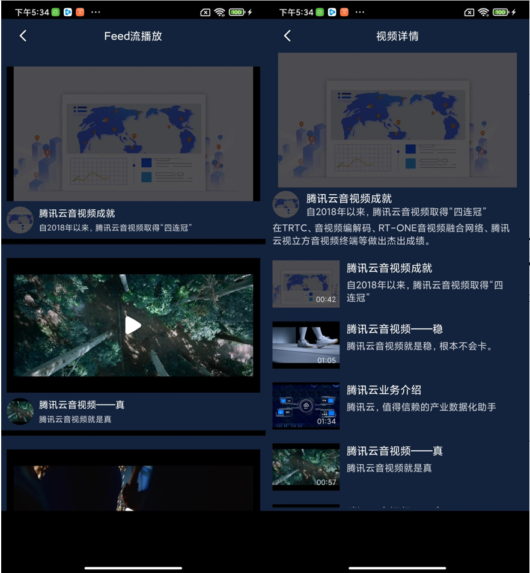
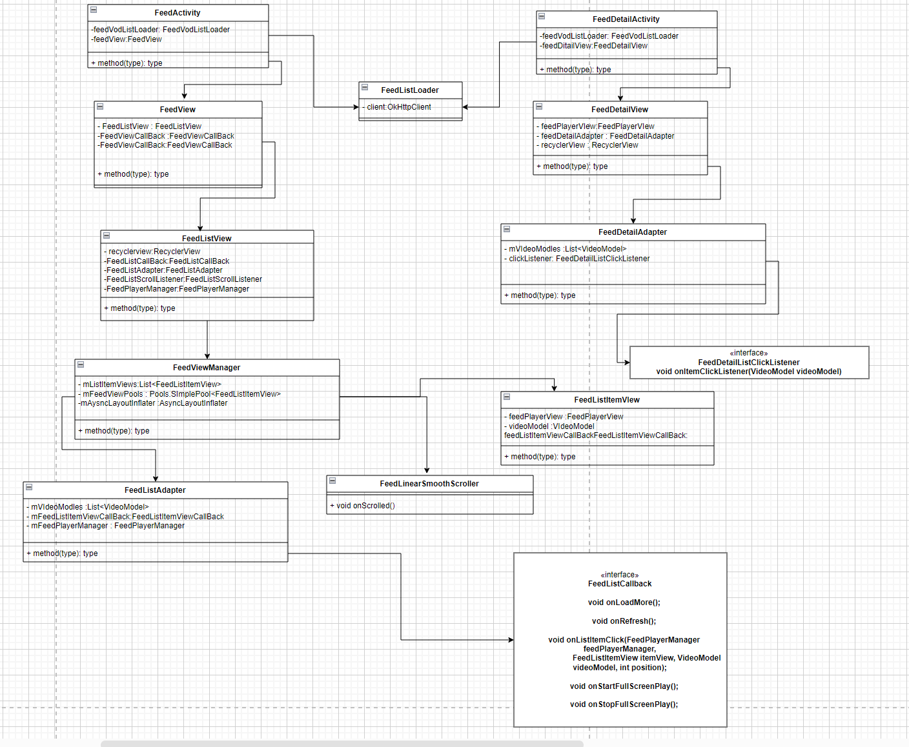

# FeedStreamPlayer
========
### FeedStreamPlayer is a list video player which imitate like Tencent News

#### ImitateTikTokPlayer function

 * window play
 * fullscreen play
 * auto play first visiable item when stopping sliding
 * resume and pause function
 * switch video when pointed

**Note:** after download the demo, u need to set License throw `TXLiveBase#setLicence`.

**Note:** u can apply the  free license in [tencent cloud 's website](https://cloud.tencent.com/act/event/License)

----------------------------

Code reuse
----------------------------
 * if you want to resue the view of list of players , u just need add `FeedView` to your view
 * if you want to resue the view of detail player, u just need add `FeedDetailView` to your view
 * if you want to resue the view of player view(include window player and fullscreen player), u just need add `SuperplayerView` to your view

FeedStreamPlayer Player's architecture diagram
----------------------------

------------------------------

License
-------
Copyright (C) 2012-2021 tomridder

ImitateTikTokPlayer's source code can be used according to the [Apache License, Version 2.0](LICENSE).
